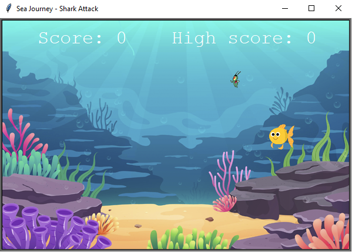
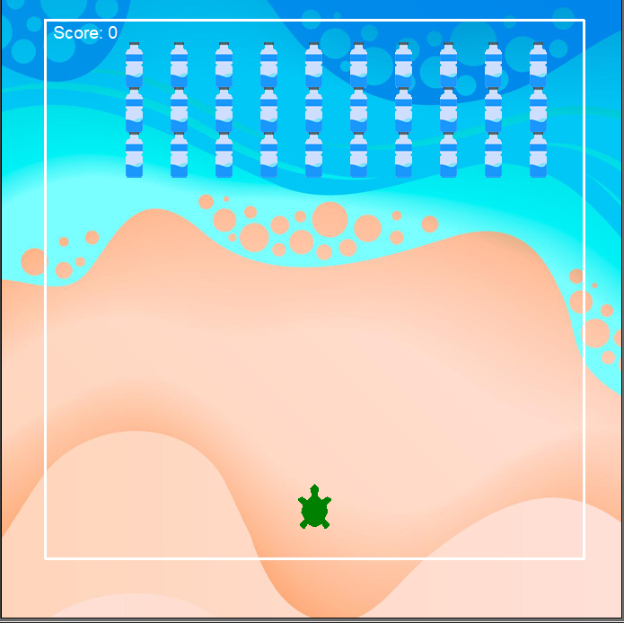

# Sea Journey - 2021
### UFRJ Analytica Time 2 / ODS 14 - Vida na água - EQUIPE VENCEDORA!


#### Apresentação 

> Use essa seção para falar sobre as motivações de seu time e, de forma breve, qual o produto que estão trabalhando. Se possível forneça **o que** seu produto é, por exemplo: Um app, uma aplicação web, gadget, dentre outros.

O nosso produto surgiu com a ideia de ser uma fonte de aprendizado sobre o ambiente aquático, mas que fosse dado por meio do entretenimento. Nesse sentido, seria possível educar e construir a ideia sobre vida marinha de maneira divertida, mas levantando pontos importantes como o tema da poluição da água e sobre como funciona a cadeia alimentar marinha. Assim, o jogador desenvolverá as habilidades para ser um futuro defensor da causa marinha. Atualmente, o produto é uma aplicação de jogos lúdica, em que a criança poderá rodar no seu computador os jogos presentes na aplicação.

#### O Produto

> Adicione detalhes sobre seu produto. Levante pontos positivos, o porquê dele ser inovador, como ele se alinha com o cluster escolhido e quaisquer outras informações relevantes ao entendimento do 'porquê' e 'como' seu produto existe e atua.

Nossa aplicação consiste em 2 (dois) jogos.

O primeiro, baseado no clássico Snake, trata-se de uma aplicação em que o jogador controla um peixinho dourado que come plânctons. A cada plâncton ingerido, o peixinho ganha uma filha que o segue. Nossa intenção com esse jogo é aproximar a criança da vida marinha por meio dessa conexão direta que ela terá com o peixinho dourado e sua família e, também, apresentar a cadeia alimentar. 

Para jogar, **utilize as setas direcionais de seu teclado**. 

**Após perder, o segundo jogo se iniciará automaticamente em 5 segundos**.



O segundo, baseado no inesquecível Space Invaders, é sobre uma tartaruga que tenta limpar a sua praia dos lixos pláticos jogados ao mar. Queremos mostrar a importância de jogar lixo apenas nos compartimentos corretos para assim preservar a vida marinha.

Para jogar, **utilize as setas direcionais "esqueda" e "direita" para movimentar a tartaruga, e pressione a barra de espaço para fazê-la remover o lixo plástico**. 

**Após o término**, tendo ganhado ou perdido, **a tela se fechará automaticamente em 5 segundos**.



#### Informações adicionais 

> Forneça informações adicionais, adicione novos tópicos ou subtópicos. Use esse arquivo como um guia rápido para manter claro os objetivos de seu projeto para os demais integrantes. Manter o foco conjunto de forma coesa lhe ajudará a criar um produto mais *sólido*.

> Tenha em mente que seu trabalho nesse repositório será avaliado por um Juri Técnico, informações sobre a tecnologia usada também são bem vindas. 

Para rodar esse código na sua máquina, é necessário ter pelo menos a versão 3.6 do Python instalada. Caso não saiba qual sua versão, é possível conferí-la no terminal da seguinte forma:

```
python3 --version
```

Se for necessário atualizá-la, [confira aqui como atualizar seu Python](https://www.pythoncentral.io/how-to-update-python/).

Possuindo a versão correta da linguagem, execute os comandos abaixo para poder jogar e se divertir!

```
git clone https://github.com/hackingrio/hackingrio-2021-ods-14-ufrj-analytica-time-2.git

cd hackingrio-2021-ods-14-ufrj-analytica-time-2

python3 main.py
```
